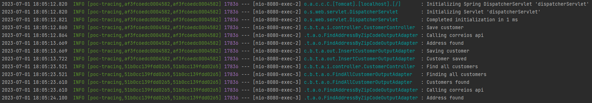

<div align="center">


</div>

<div align="center">

# POC Tracing Spring Cloud Sleuth


</div> 

<div align="center">
</div>

## Fundamentos teóricos

> O Spring Cloud Sleuth é uma biblioteca projetada para facilitar o rastreamento distribuído em sistemas baseados em microservices. Ele é parte do ecossistema do Spring Cloud e oferece recursos para adicionar identificação única a cada solicitação em um ambiente distribuído, permitindo o rastreamento do fluxo de uma solicitação por todos os serviços envolvidos.

> Em resumo, ele simplifica o processo de rastreamento, facilita a depuração e o diagnóstico de problemas e oferece integração com ferramentas de monitoramento avançadas. Com o Sleuth, você pode ter uma visão abrangente e detalhada do fluxo de suas solicitações em um ambiente distribuído, melhorando a qualidade e o desempenho de seus serviços.

> **Vantagens😆🧘👍🌈🌞**
```
1-Rastreamento de ponta a ponta: Com o Sleuth, você pode rastrear o percurso completo de uma solicitação em um ambiente distribuído, identificando cada serviço envolvido e o tempo gasto em cada um deles.

2-Depuração e diagnóstico simplificados: O rastreamento distribuído fornecido pelo Sleuth facilita a identificação e resolução de problemas, permitindo que você localize rapidamente gargalos de desempenho, falhas de comunicação ou erros em seu ambiente de microservices.

3-Integração com ferramentas de monitoramento e observabilidade: O Sleuth pode enviar informações de rastreamento para sistemas externos, como o Zipkin e o Jaeger, que oferecem recursos avançados de monitoramento e análise de desempenho. Isso permite uma visibilidade aprimorada e insights valiosos sobre o comportamento de seus serviços.

4-Facilidade de uso e configuração: O Sleuth é projetado para ser fácil de usar e configurar. Ele se integra perfeitamente ao ecossistema do Spring Cloud e fornece anotações simples para controlar o escopo do rastreamento. Além disso, a configuração básica pode ser facilmente ativada com algumas configurações no arquivo de propriedades.
```
## Exemplo de log utilizando o Tracing do Spring Cloud Sleuth



## Funcionalidades

| Métodos de requisição HTTP  | Descrição                       |
|-----------------------------|---------------------------------|
| `POST`                      | Inserir cliente                 |
| `GET`                       | Listar todos os clientes salvos |
| `GET`                       | Buscar cliente por Id           |
| `PUT`                       | Atualizar cliente               |
| `DELETE`                    | Deletar cliente                 |

##  Pré -requisitos

- [ `Java 19+` ](https://www.oracle.com/java/technologies/downloads/#java19)
- [ `Maven 3+` ](https://maven.apache.org/download.cgi)
- [ `Docker-Compose` ](https://docs.docker.com/compose/install/)
- [ `Docker` ](https://www.docker.com/)
    - Imagem Apache Kafka
    - Imagem Apache ZooKeeper

## Tecnologias
- Java 19
- Apache Maven
- Apache ZooKeeper
- Apache Kafka
- Spring Boot 2.7.7
    - spring-boot-starter-web
    - spring-boot-starter-data-jpa
    - spring-boot-devtools
- Lombok
- H2
- Tomcat (Embedded no Spring Boot)
- Git

## Portas
| Aplicação                        | Porta |
|----------------------------------|-------|
| poc-kafka-hexagonal-architecture | 8080  |
| kafka                            | 9092  |
| zookeeper                        | 2181  |

## Links

- Aplicação
    - http://localhost:8080
    - https://viacep.com.br/ws/{zipCode}/json/

>## Setup

### Executando a aplicação com maven
- Na raiz do projeto execute o seguinte comando:
  ```
  ./mvnw clean package -DskipTests
  ```

### Gerando imagem docker
- Na raiz do projeto execute o seguinte comando para criar a imagem docker da aplicação:
  ```
  docker build --tag hexagonal-architecture .
  ```  

### Executar docker-compose para subir aplicação com container docker
- Dentro da pasta docker-compose, execute o seguinte comando para subir os containers:
  ```
  docker-compose up -d
  ```
- Execute o seguinte comando para verificar os status do containers docker:
  ```
  docker-compose ps
  ```

### Method: POST
- URL: http://localhost:8080/api/v1/customer/save/{zipCode}
  #### Payload Request:
  ```
  {
  "name": "Teste-01",
  "cpf": "001.002.003-04"
  }
  ```
### Method: GET
- URL: http://localhost:8080/api/v1/customer/findAll
### Method: GET
- URL: http://localhost:8080/api/v1/customer/find/{id}
### Method: PUT
- URL: http://localhost:8080/api/v1/customer/update/{id}
  #### Payload Request:
  ```
  {
  "name": "Teste-02",
  "cpf": "001.002.003-04"
  }
  ```
### Method: DELETE
- URL: http://localhost:8080/api/v1/customer/delete/{id}

#

>## Desenvolvedores

**Leandro D'Souza**
- LinkedIn - www.linkedin.com/in/francis-leandro-de-souza
- GitHub - https://github.com/lsouzatj